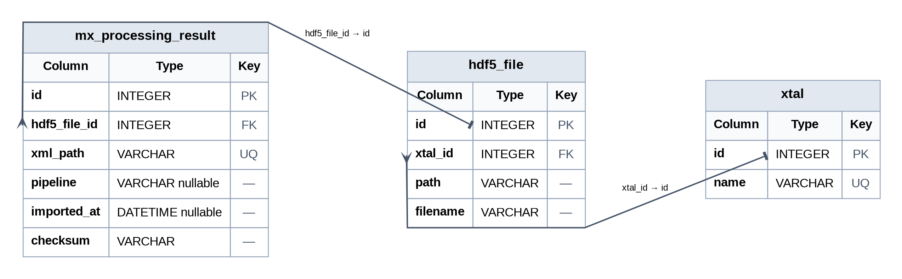

# fragflows

Processing flows for X-ray crystallographic fragment screening at NSLS-II.

## Overview

`fragflows` is a collection of modular processing flows designed to automate and standardize the analysis of X-ray crystallographic fragment screening datasets generated at the NSLS-II X-ray crystallographic fragment screening facility. The field of x-ray crystallographic fragment screening is rapidly evolving, and even though facilities are working towards standard practices with the PDBe/RCSB-PDB/PDBj there are a myriad of conventions and customized workflows which can be overwhelming to new (and current!) practitioners. At NSLS-II we are dedicated to helping you organize, analyze, and share your data in a reproducible, interpretible manner that is in line with the current community guidelines.

Currently, support is only provided for the NSLS-II computing environment.

## Table of Contents

- [Installation](#installation)
- [Usage](#usage)
- [Flows](#flows)
  - [Gather x-ray data](#gather-x-ray-data)
  - [Run dimpleflow](#run-dimpleflow)
  - [Run ligandflow](#run-ligandflow)
  - [pandda.analyse](#panddaanalyse)
  - [pandda.inspect](#panddainspect)
  - [Run refineflow](#run-refineflow)
  - [Group deposition preparation](#group-deposition-preparation)
- [Examples](#examples)
- [License](#license)

---

## Installation

Clone the most recent version of the fragflows repository into your project's processing directory:

```bash
cd 123456-mytarget-processing
git clone https://github.com/NSLS2/fragflows.git
cd fragflows
```

Activate the following conda environment.

## Usage

### Prerequisite

Fragflows requires v2.7.3 of the prefect workflow manager installed in a conda environment available in `/nsls2/software/mx/conda_envs/2023-1.0-py39`.
Prior to running any script or workflow, activate this conda environment:
```bash
conda activate /nsls2/software/mx/conda_envs/2023-1.0-py39
```

### Edit yaml configuration file

In the base fragflows directory there is a yaml configuration file containing the absolute directory (or file) paths required as input for the various flows. The user should use their preferred text editor for editing each flow block to correspond with the directory structure of their project. We strongly recommend, but do not enforce, including an ISO8601 compliant timestamp in the filename of each output directory, often terminated with a "-" separator followed by a job number if multiple jobs are run concurrently or on the same day.

```yaml
dimpleflow:
  processing_data_directory: "/nsls2/data/amx/proposals/2024-3/pass-123456/123456-mytarget-processing/"
  models_directory: "/nsls2/data/amx/proposals/2024-3/pass-123456/123456-mytarget-processing/models_20241220-1"
  reference_pdb: "/nsls2/data/amx/proposals/2024-3/pass-123456/123456-mytarget-processing/pandda_analyse_ccp4-7.0_20241203-1/reference/mean_map_placed_reference_model-coot-1_placed.pdb"
  filtered_xray_csv: "/nsls2/data/amx/proposals/2024-3/pass-123456/123456-mytarget-processing/fragflows/mytarget.20241203.filtered.csv"

ligandflow:
  root_dir: "/nsls2/data/amx/proposals/2024-3/pass-123456"
  models_directory: "/nsls2/data/amx/proposals/2024-3/pass-123456/123456-mytarget-processing/models_20241220-1"
  ligand_csv: "/nsls2/data/amx/proposals/2024-3/pass-123456/123456-mytarget-processing/mytarget.ligands.csv"

gather_xray_data:
  data_directory:
    - "/nsls2/data/amx/proposals/2024-3/pass-123456/dir1"
    - "/nsls2/data/amx/proposals/2024-3/pass-123456/dir2"
  sample_name: "mytarget"
```

### Gather x-ray data
Prior to running the processing flows, diffraction data and lab soaking metadata must be gathered and integrated. To accomplish this task for the x-ray data we have provided the gather_xray_data.py script, which will create a csv file containing the association between `xtal_id` and the absolute file path of the scaled/merged mtz file output by either autoPROC or fastDP pipelines. At this stage we only filter for the highest resolution dataset in the case of redundant results, i.e. a dataset from each pipeline. Further filtering logic, e.g. spacegroup or resolution, can be applied to the *filtered* x-ray data spreadsheet immediately prior to running dimpleflow.

Edit the `gather_xray_data` section of the yaml configuration file to include the root path of the directory under which the campaign x-ray data was auto-collected.

More recent versions of fragflows will crawl beamline data directories and search for xml files output by mx-processing pipelines such as fast_dp or autoPROC. There is some slight variation in the xml schema employed by the various pipelines, but they are similar enough that we can use these files to automatically populate the required _reflns and _reflns_shell cif loops required for PDB deposition.


*Figure 1: fragflows.db schema*

```bash
cd fragflows
conda activate /nsls2/software/mx/conda_envs/2024-2.0-py311
python gather_xray_data.py
```

```
usage: gather_xray_data.py [-h] [--update] [--db DB] [--r_mrg_threshold R_MRG_THRESHOLD] [--symm SYMM] [--symm_strict SYMM_STRICT] [--csv CSV] [--no_filter]

options:
  -h, --help            show this help message and exit
  --update              if set, will update the database with new files instead of creating a new one
  --db DB               path to SQLite database file
  --r_mrg_threshold R_MRG_THRESHOLD
  --symm SYMM           a fuzzy selection filter for space group, e.g. C222 will pick up C2221
  --symm_strict SYMM_STRICT
                        if set, will only consider files with this exact space group.
  --csv CSV             if set, will save the filtered dataframe to a csv file with this name instead of the default ISO8601 timestamped name
  --no_filter           if set, will not filter the dataframe based on r_mrg and symm, and will instead return all rows in the database
```

Running `gather_xray_data.py` for the first time will instantiate a SQLlite db file that contains the processed diffraction data results. We've included selection filters for applying filtering logic to select a unique "best" processing result for each xtal-id. Including the --no_filter option will dump the entire db to a csv file to facilitate plotting or more complex filtering prior to `dimpleflow` and `pandda.analyse`.


### Run dimpleflow
In the ideal project there will be hundreds to thousands of datasets of sufficient resolution (<2.8 Angstrom) in a consistent point group. There may be slight discrepancies in space group assignments due to misidentified translational symmetry operators, particularly in orthorhombic space groups, but these discrepancies should not be an issue provided there is a consistent point group. Prior to beginning the fragment screening campaign, users should provide a completely refined, high-resolution model, including solvent molecules, to phase these hundreds to thousands of datasets.

Edit the `dimpleflow` block of the yaml configuration file to point to the fully refined reference model and create the result directory to which dimpleflow will write results. For dimpleflow, we use the version of dimple provided with ccp4-7.0, so activate this version of ccp4 as well prior to running the flow. Note that dimpleflow can be run from a Horizon client VM or on one of the uranus compute nodes with up to 30 jobs in parallel. Currently the bottleneck for the number of concurrent jobs is related to sqlite database access from using local user prefect installations. Future versions of fragflows will aim to remove this limitation.

```bash
cd 123456-mytarget-processing
mkdir models_20250618-1
cd fragflows
source /nsls2/software/mx/ccp4-7.0/bin/ccp4.setup-sh
python dimpleflow.py
```
The output of dimple flow is used as the input to `pandda.analyse` with the `data_dirs=` keyword argument. At this stage it is worthwhile to manually inspect several of the models with Coot or ChimeraX to verify that dimpleflow went well prior to setting up the `pandda.analyse` run.

### Run ligandflow
The mxplate Jupyter notebook, which contains the soaking lab metadata, will output a *ligands* csv file that contains the association between each fragment SMILES, catalog_id, and xtal_id. There is a one-to-one relationship between the `xtal_id` key in the ligand table and the x-ray diffraction data table; ligandflow.py will use the CCP4 program AceDRG ([10.1107/S2059798317000067](https://doi.org/10.1107/S2059798317000067)) to generate restraints for each added fragment based on the vendor-provided SMILES string. AceDRG will then generate CIF restraint files named with the given catalog_id within within each dimpleflow subdirectory. The flow should be run prior to launching `pandda.analyse` to allow for restraint file pre-loading during `pandda.inspect`.

To run ligandflow.py, edit the appropriate sections in the yaml config file, followed by:
```bash
cd fragflows
python ligandflow.py
```

### pandda.analyse
`pandda.analyse` will apply the pandda algorithm ([10.1038/ncomms15123](https://doi.org/10.1038/ncomms15123)) to the data in the dimpleflow models directory. Often one or two pandda.analyse pre-runs will be necessary to figure out the optimal set of parameters for the main `pandda.analyse` run. `pandda.analyse` will impose some additional filtering on the dimple datasets based on factors such as R-free, predominant space group, or low resolution completeness. Occasionally datasets missing some low resolution reflections may be flagged and these datasets will either need to be removed from the dimpleflow directory or marked with the `ignore_datasets=` keyword argument.

Additionally, if there are more than 500 datasets, a `max_new_datasets=` keyword argument will also need to be defined with a value greater than the total number of datasets being analyzed. We recommend running the main `pandda.analyse` run on one of our 300+ core AMD nodes.

We recommend a minimum of three `pandda.analyse` runs. The first run will be to flush out any issues with the input diffraction data and to model in bonafide fragment hits with `pandda.inspect`. This first pass will allow for an estimation of the hit rate and for detection of any data pathologies such as those arising from conformational changes within the input datasets.

### pandda.analyse (first run)
```bash
source /nsls2/software/mx/scripts/pandda_setup.sh
cd /nsls2/data/amx/proposals/2025-2/pass-123456/123456-mytarget-processing
pandda.analyse output_dir="pandda_analyse_ccp4-7.0_20250618-1" pdb_style="*.dimple.pdb" max_new_datasets=1000 cpus=200 ignore_datasets="mytarget-103,mytarget-744" data_dirs="models_20241220-1/*"
```

### pandda.analyse (second run; mean map calculation)
The purpose of the second `pandda.analyse` run is to calculate a high resolution mean map, which will be used to manually real space refine a high resolution reference model. If there were no issues detected in the initial analyse run then the second run will use the same parameters with an additional parameter of `calculate_first_average_map_only=True`; `output_dir` should also be incremented to create a new analyse directory. 

```bash
pandda.analyse output_dir="pandda_analyse_ccp4-7.0_20250618-2" pdb_style="*.dimple.pdb" max_new_datasets=1000 cpus=200 ignore_datasets="mytarget-103,mytarget-744" data_dirs="models_20241220-1/*" calculate_first_average_map_only=True
```
The resulting mean map will be placed as a ccp4 map file in the `reference/statistical_maps` subdirectory in the main analyse directory. A symlink to a high resolution reference model will be placed in `reference`. The map and the reference model will have different frames of reference, so the model will need to be docked into the map. If possible this docking can be achieved manually with chimerax or a robust automated docking protocol can be run with `phenix.dock_in_map`. At NSLS-II this can be achieved with the following commands assuming that you are already in the main analyse directory created with this second average map run:

```bash
source source /nsls2/software/mx/phenix-1.20.1-4487/phenix_env.sh
cd reference/statistical_maps
phenix.dock_in_map ../reference.pdb <mean map ccp4 file> crystal_info.resolution=d_min
```
Note that you should use the resolution in the name of the mean map file for `d_min`. Once this model is successfully docked, manually iterate through the entire model correcting any sidechain motion and ordered solvent displacement. When manual correction is complete, open a copy of the original reference model and use Coot's LSQ feature to superimpose the corrected model back onto the reference model. Save this model and edit the relevant dimpleflow parameter in `config.yaml`. Finally, re-run dimpleflow in a new `models_*` directory using the recently created average reference model. The resultant dimpleflow output will be used in the third and final `pandda.analyse` step.

### pandda.analyse (third run; final)
The final `pandda.analyse` run will be very similar to the parameters used in the first successful run, with the exception of an updated `data_dirs` that should now point to the most recent dimple directory created using the average reference model. This run will be used to create the ensemble models that are ultimately deposited in the pdb.
```bash
pandda.analyse output_dir="pandda_analyse_ccp4-7.0_20250618-3" pdb_style="*.dimple.pdb" max_new_datasets=1000 cpus=200 ignore_datasets="mytarget-103,mytarget-744" data_dirs="models_YYYYMMDD-N/*" \
```

### pandda.inspect
Once `pandda.analyse` has successfully run, each resultant event can be inspected with `pandda.inspect`.
```bash
cd pandda_analyse_ccp4-7.0_20250618-1
pandda.inspect
```
In `pandda.inspect` the user must manually check if the shape in the density map is consistent with the chemical identify of the fragment compound that was ejected into the crystallization droplet. At this stage the user should delete any ligand H atoms and model the fragment compound into the event density map using real space refinement. Note that the event density map will be P1 and is only valid within an approximate 5-10 Angstrom radius around the event. The pandda algorithm aims to empirically determine the optimal BDC or Background Density Correction factor based on maximizing local contrast of this region compared to the global average of the map. So, effort should be made to adjust sidechains, backbones or solvent molecules only within this proximal region.

### exportflow
Once hit structures have been appropriately modeled and updated with `pandda.inspect`, the next step is to generate the bound-unbound (or changed-unchanged) ensemble models and restraint files for subsequent crystallographic refinement against the measured structure factors for each individual hit structure.

During manual inspection and annotation, the user should update the `Ligand Confidence` and `Ligand Placed` fields in the `pandda.inspect` provided Coot GUI. These fields can be used to determine which structures to export for subsequent ensemble refinement and ultimately inclusion in the "changed state" group deposition.

Currently, a text file containing the directories to export can be generated with the following python snippet. You may edit the snippet if for example you weren't too diligent about checking the correct `Ligand Confidence` and you wanted to include every event for which a ligand was placed. The export.txt file is essentially the hit structure manifest defined by the user:

```python
import pandas as pd
df = pd.read_csv('pandda_inspect_events.csv')
with open('structures2export.txt','w') as f:
    for d in df[(df['Ligand Placed'] == True)*(df['Ligand Confidence'] == 'High')]['dtag']:
        f.write(f'{d}\n')
```

Append the following section to `config.yaml`:

```yaml
exportflow:
  export_data_directory: "/nsls2/data/amx/proposals/2025-1/pass-317840/317840-ftsz-processing/test_export_flow_20260402-1"
  pandda_analyse_directory: "/nsls2/data/amx/proposals/2025-1/pass-317840/317840-ftsz-processing/pandda_analyse_ccp4-7.0_20250929-1/processed_datasets"
  export_list: "export.txt"
  ground_basename: "pandda-input"
  changed_basename: "pandda-model"
  ensemble_basename: "ensemble-model"
  validate_only: False 
```

#### exportflow Configuration Parameters

The following table describes all configuration parameters for the exportflow:

| Field | Description |
|-------|-------------|
| `export_data_directory` | The directory name which exportflow will write and copy files into; auto crystallographic refinement will also occur in this directory |
| `pandda_analyse_directory` | The final pandda.analyse run directory with final hits modeled via pandda.inspect; note that you'll need to use the processed_datasets subdirectory |
| `export_list` | The list of xtal-id names to be exported |
| `ground_basename` | Designates "ground" or "unchanged" structures; structure files with this descriptor in the filename will be designated as such (typically shouldn't need editing) |
| `changed_basename` | Designates the "bound" or "changed" state; structure files with this descriptor in the filename are output by pandda.inspect |
| `ensemble_basename` | Ensemble models will be output with this descriptor in the filename |
| `validate_only` | Set to `False` for a dry run; set to `True` to attempt generating ensemble models and accompanying restraint files (only after obtaining a clean validate.json report) |

`exportflow` is a prefect flow, so for now you'll need to make sure the correct conda environment is active:
```
conda activate /nsls2/software/mx/conda_envs/2023-1.0-py39
python exportflow.py
```

There are several input options that allow you to run `exportflow` on a subset of xtal-ids in the export manifest file. You can also tune `eps` the main parameter used by DBSCAN for spatial cluster determination. Occasionally, you may need to make `eps` slightly larger.

```
usage: exportflow.py [-h] [--datasets DATASETS] [--eps EPS] [--ignore_datasets IGNORE_DATASETS] [--mix_coeff MIX_COEFF]
                     [--donor_solvent_threshold_dist DONOR_SOLVENT_THRESHOLD_DIST]

Export flow script

optional arguments:
  -h, --help            show this help message and exit
  --datasets DATASETS   Comma-separated list of datasets to process (e.g. d1,d2,d3)
  --eps EPS             epsilon parameter for DBSCAN clustering during occupancy cluster assignment
  --ignore_datasets IGNORE_DATASETS
                        Skip these datasets when exporting
  --mix_coeff MIX_COEFF
                        proportion of acceptor, donor mix, similar concept to bdc, value of [0,1]
  --donor_solvent_threshold_dist DONOR_SOLVENT_THRESHOLD_DIST
                        threshold distance which raises an exception if donor solvent altlocs are further apart than this distance in Angstroms
```

### Ensemble models
In fragflows `exportflow` we have re-implemented the PanDDA-v1 (PV1) algorithm for ensemble merging with a few modifications to handle some edge cases that we've regularly encountered. These cases include, but are not limited to, residues that are partially split across altlocs or clashing solvent label namespaces which can occur during event modeling.

Some facilities use PV1 ensembles, whereas others deposit only the changed or bound state. PV1 ensembles, which are basically composite models comprised of weighted averages of changed states (from pandda.inspect) and ground states (from dimple), attempt to approximate partial occupancy binding events in a crystallographically sensible way. There are arguments to be made for either approach, but here at NSLS-II we have opted to use PV1 ensembles for the time being.

The subtelty lies in the defining what exactly is the ground state. In the PV1 approach, we assume that there is a single representative ground state model with which we phase and autorefine all of the individual diffraction datasets. The resultant ground state model assigned to each diffraction dataset will be unique due to the initial phase/refine run, but this model will not capture large conformational changes or loop rearrangements. The true ground state model is likely a sample from a distribution of possible models, but for practical reasons we will approximate this ideal model with a representative or average model of this distribution. A potentially more accurate model might use something similar to the following Bayesian network graph.

```
 A,B,C
   │
   ▼
Ground ─────► Binding
   │             │
   └────┬────────┘
        ▼
     Changed
```
$P(Changed,Ground,Binding,A,B,C)=P(Changed|Ground,Binding)P(Ground|A,B,C)P(Binding|Ground)P(A,B,C)$

Upon first encounter the PV1 ensemble-generation algorithm can be perplexing, but after further inspection it is really quite simple. PV1 applies the algorithm at the residue level, but the logic can readily be extended to individual atoms (or any discrete chemical entity).

For a single model with N atoms imagine that there is an atom with three possible altlocs {A,B,C}, which we define as the max_altloc set. Now, if you transfer these labels to all atoms there will be ~3N atoms. Then you can assign a position $x_i=f(a_i,l_i)$ for each atom ($a_i$) and label($x_i$) and use the position to define a distance function $d_{ij}=|d(x_i)-d(x_j)|$. Finally, you can choose a small $\epsilon$ to spatially cluster all atoms if $d_{ij}\lt\epsilon$ and assign cluster labels $c_i$.

If there is only one cluster and the number of atoms in the cluster is equal to the number of unique altloc labels, i.e. all the atoms were modeled in the same position, then the labels are removed and only a single atom remains with the null altloc label, '\x00'.

If there were two clusters for an atom in our three possible altloc model, then there would be three unique atoms, two of which would be restrained during refinement to be in the same position.

Here `exportflow` will apply the aforementioned procedure to generate altloc labels for both changed and ground state. In the code these states are referred to as acceptor and donor states, aptly named because the donor model altloc labels will be incremented, e.g. ${A,B,C}->{D,E,F}$, to avoid clashing with the acceptor labels. We have made the changed state the acceptor state with ${A,B,...}$ by default, because researchers have a tendency to extract only the $A$ altloc from mult-altloc models for downstream analysis. This convention thus ensures that anyone taking part in this practice will automatically obtain the altloc with the fragment molecule.


### Run refineflow
The `exportflow` step will generate an ensemble model which contains a "crystallographically correct" composition of the *ground state* model output by dimple and the *changed state* model resulting from editing the refined dimple model to be consistent with the corresponding event map. Included with each ensemble model is a set of occupancy group and position restraints specific for each structure. Currently, Refmac is our preferred macromolecular refinement program for properly handling these special partial occupancy restraints. To run the refineflow activate ccp4-9 and edit the relevant sections of the yaml configuration file. The `basename` and `basename_hkl` keys are used to identify the ensemble structure and measured amplitudes used for refinement respectively.

```bash
source /nsls2/software/mx/ccp4-9/bin/ccp4.setup-sh
cd fragflows
python refineflow.py
```
The refineflow will generate two mmcif files in each `pandda.export` subdirectory, one containing the refined structure factors and 2*m*Fo-*D*Fc map coefficients and the other containing the atomic coordinate model with additional blocks appended for the fragment CIF restraints used during refinement.

### Group deposition preparation
## Note on convention
To date there is not a clear consensus on the optimal protocol for handling and disseminating these large x-ray fragment datasets ([10.1038/s41467-025-59233-z](https://doi.org/10.1038/s41467-025-59233-z)). At NSLS-II our analysis and deposition workflow is most similar to Approach 4 in the aforementioned reference. In addition, we are operating with the mantra that *incomplete is preferrable to incorrect*. That is, fragments are placed only if there is unequivocal evidence in the event map and ideally corroborating H-bonding or salt-bridge interactions that further inform the ultimate pose. Following this approach, false positives are highly unlikely. However, the corollary is that there may be false negatives, ligands with reasonable evidence for binding may be marked as "ground state". There may also be chemical modifications, e.g. acylation, epimerization, or racemization, to the fragment molecule. With high enough resolution and knowledge of the crystallization components it may even be possible to deduce reasonable mechanisms that describe the observed event map density shape. These are interesting results which would warrant further investigation in a more conventional MX project, in our convention if the modification is more complex than simple epimerization of a stereogenic center then we simply do not build in the molecule and the structure is excluded from the changed state group deposition. An exception to this rule is that we will place a fragment if a subset of the observed density is clearly consistent with the shape of the presumed fragment, in these cases we do not make any attempt at guessing the chemical identity of the extended portion of the fragment.

Asymmetric units which contain non-crystallographic symmetrically related copies of the protein or nucleic acid target molecule will likely give rise to multiple events. Associations between placed fragment ligands and events are made based on Euclidean distance. In the event that an x-ray dataset gives rise to multiple events, separate event blocks are appended for each placed fragment molecule to generate the final composite structure factor CIF file.

## Data organization
At this stage in the workflow we need to create references to the ensemble refinement data generated by refineflow. The following python snippets can be used to create three separate tables with the following keys:

```yaml
refinement_table:
  - uid # uuid for a refined structure (foreign key in event table)
  - xtal_id # human readable unique id for a refined structure, usually mytarget-###
  - refined_structure_file # mmcif absolute path
  - refined_reflection_file # mmcif absolute path
  - smiles # added fragment SMILES string
  - catalog_id # vendor-provided alphanumeric catalog_id
  - input_structure_file # the ensemble model input into the refinement program

event_table:
  - uid # uuid for an event extracted from pandda_inspect_events.csv
  - xtal_id # human readable unique id for a refined structure
  - event_idx # integer uid of an event
  - 1-BDC # background corrected correction factor
  - event_map_file # absolute path to ccp4 map file for unique event
  - xtal_uid # uuid for crystal associated with an event
  - x # x real space coord of unique event
  - y # y real space coord of unique event
  - z # z real space coord of unique event

refinement_validation_table:
  - uid # uuid for each placed fragment ligand, multiple possible per xtal
  - xtal_uid # foreign key xtal uuid
  - chain_id # chain label of place fragment
  - residue_name # three letter name used during refinement, default UNL
  - seqid # sequence id of placed fragment
  - real_space_mean # interpolated value of 2mFo-DFc weighted refined density, eval at frag. centroid
  - real_space_var # variance of 2mFo-DFc weighted density, eval at frag. centroid
  - real_space_cc # real space pearson corrcoeff of placed fragment
  - diff_z_score # Z score of mFo-DFc coefficients
  - nearest_event_mean # interpolated event map density, nearest event eval at frag. centroid
  - nearest_event_var # variance of event map density, nearest event eval at frag. centroid
  - nearest_event_cc # pearson corrcoeff of placed fragment with closest high confidence event
  - lig_prot_b_iso_ratio # ratio of fragment to protein b factor
  - nearest_event_no_pbc # closest Euclidean event uid with no periodic boundary conditions
  - dist_to_nearest_event # Euclidean distance to nearest high confidence event
```

Snippets for generating data tables, refinement validation table generation will take some time due to iterating through each event map:

```python
import pandas as pd
from deposition.tables import *
export_dir = '/nsls2/data/amx/proposals/2024-3/pass-123456/123456-mytarget-processing/pandda_export_20250618-1/'
dataset_csv = '/nsls2/data/amx/proposals/2024-3/pass-123456/123456-mytarget-processing/fragflows/mytarget.20241203.filtered.csv'
ligand_csv = '/nsls2/data/amx/proposals/2024-3/pass-123456/123456-mytarget-processing/mytarget.ligands.csv'
df1 = generate_refinement_table(export_dir, dataset_csv, ligand_csv)
df1.to_csv('mytarget_refinement_table.csv')
df2 = generate_event_table(export_dir, events_csv, 'mytarget_refinement_table.csv')
df2.to_csv('mytarget_event_table.csv')
df3 = generate_refinement_validation_table('mytarget_refinement_table.csv','mytarget_event_table.csv')
df3.to_csv('mytarget_refinement_validation_table.csv')
```
A spreadsheet editor such as libreoffice or MS Excel can be used to sort the fitted ligands based on any of the individual validation parameters. Notably overlapping atoms in the ground state can result in outliers for the `nearest_event_cc` parameter. For example, if a fragment contains a fluorine atom that displaces a water molecule in the ground state, the value of the interpolated event map density at that position will be artificially low compared to the calculated density of the fluorine atom due to cancellation. These occurrences can skew the calculation of the corresponding pearson correlation coefficient. The distance to the nearest event should also be no great than approximately 10 Angstroms, unusually large values for this distance imply that there was an error in updating the `Ligand Placed` or `Ligand Confidence` fields during `pandda.inspect`. It is important that any outliers or erroneous fittings are identified and corrected, because this distance is used to associate event map cif blocks with bound ligands in the deposited structure factor files.